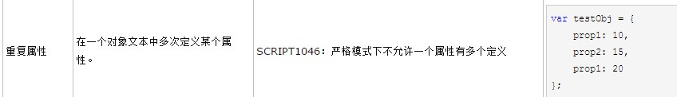

# 严格模式下一个属性不允许多个定义

## 需求引发问题

有一个汉字首字母检索的需求，设想的解决思路是：
>
1. 将拿到的数据取出首个汉字，组成数组出入找到的js汉字转拼音库: [https://my.oschina.net/tommyfok/blog/202412](https://my.oschina.net/tommyfok/blog/202412)
2. 根据生成的首字母数组生成字母索引

## 问题出现

由于所有的代码都是在严格环境下执行,在测试时浏览器报了一个错误，*严格格模式下未定义变量* ,原来是在严格模式下同一个对象内不允许重复定义属性，经过定位发现是汉字转拼音那个库里的字典出了问题，重复定义了某一个属性
>   

## 尝试解决
1. 通过``for-in``循环遍历字典对象内所有属性，打印出重复属性并找到删除，结果失败，重复定义的属性被取成了后定义的一个值
2. 通过``Object.keys(obj)``取出字典对象所有属性，结果失败,重复定义的属性被取成了后定义的一个值

## 解决方案
    既然js对象遍历的方法都直接覆盖了前一个定义的属性，那就遍历字典对象，将key和value全打印出来，然后复制出来，当做一个新字典，这里要注意，汉字的unicode码在打印时需要转换，否则打印出来是汉字
```javascript
var GB2312UnicodeConverter = { 
    ToUnicode: function (str) {
      return escape(str).toLocaleLowerCase().replace(/%u/gi, '\\u');
      },
    ToGB2312: function (str) {
        return unescape(str.replace(/\\u/gi, '%u'));
      } 
  }

for (var p in obc){
    console.log("\"%s\"\:\"%s\",", p, GB2312UnicodeConverter.ToUnicode(obj[p]))
}
```

## 遗留问题
    写了一个demo测试，但在IE/Chrome/Node环境下运行都不会报错
```javascript
//严格模式下一个属性不允许多个定义测试demo
'use strict'
var people = {
    name: 'devil',
    age: 24,
    name: 'leo'
}
```